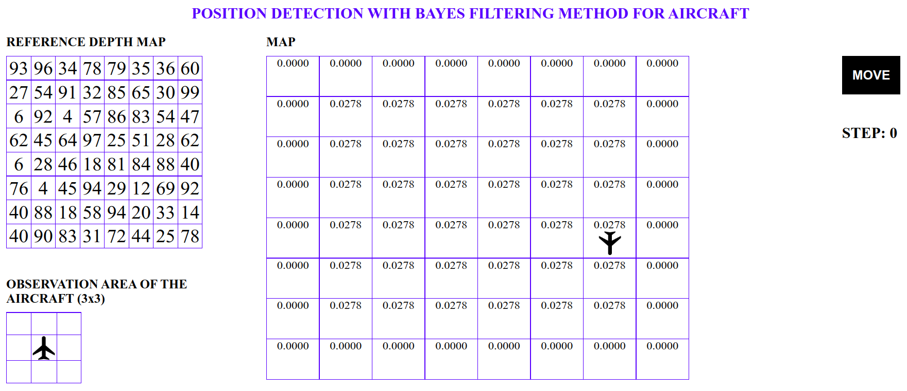

# Position-Detection-Method-For-Aircraft-JS

## How to Run:
Open **index.html** file on any browser that runs JavaScript.

## Descriptions:
This is a Position Detection With Bayes Filtering Method For Mobile Robots (Bayes Localization).

#### What is a Mobile Robot?:
Mobile robots are robots that are not fixed to a physical point and can perform desired tasks by moving in a defined environment. Mobile robots can be computer-controlled or autonomous. In both controls, sensors should be used and environmental factors should be able to be detected by the robot.

#### Types of Mobile Robots:

 
* Robots Floating in Water
* Flying Robots
* Land Traveling Robots
* BEAM (Biology, Electronics, Aesthetic, Mechanics) Robots

#### How Robots Detect Location?:
*Open Areas:*
 

 
Location determination in open areas is done by GPS (Global Positioning System). With the signals sent by the GPS satellites, the GPS receiver can detect its location exactly. Only 3 satellites are sufficient for latitude and longitude information. If altitude is desired along with latitude and longitude, it is necessary to receive signals from 4 satellites.
  
*Indoor Areas:*
 
In today's modern cities, the number of multi-storey, complex and wide-area buildings is increasing day by day. Due to the complex structures of the buildings, direct use of GPS is not possible in closed areas. For this reason, technologies such as bluetooth, wifi and RFID are used in closed areas.

#### Solution -> Bayesian Filter:
Bayesian filter shows the relationship between conditional probabilities and variable probabilities within the probability distribution for a rational variable. The following formulas are used in the solution;
* Observation Pattern: ![equation] P(Xi | Z) = P(Z | Xi) P(Xi) / P(Z)
* Transition Model: ![equation] P(Xi(t)) = Σj P(Xj(t-1)) P(Xi | Xj)
The state at time t depends on the state at time t – 1.

#### One-Dimensional Position Detection:
A mobile robot with ultrasonic sensors that can move on flat ground can position with this method. For example; In a corridor with various objects and door recesses, the robot follows the following steps;
* The robot moves in a straight line and produces the depth map thanks to the sensors.
* It makes sense of the data by dividing the area it measures into certain equal distances.
* The robot is placed at a random point and tries to determine its position according to the depth map by moving forward.
The more distinctive and different depths in the corridor where the measurement is made, the faster and more reliable the robot's positioning will be.

#### Two-Dimensional Position Detection:
    
 
With this method, an airplane, helicopter or unmanned aerial vehicle can find its position in bad weather conditions, when there is a radar malfunction or when the GPS service is disabled. The aircraft follows the following steps for location determination;
* The aircraft uses DTED (Digital Terrain Elevation Data) as the reference depth map.
* It measures with SAR (Synthetic Aperture Radar) radar.
* It tries to determine the location by comparing the measurements it makes with the reference map.

## Screenshots:
<kbd></kbd>
  
<kbd></kbd>
